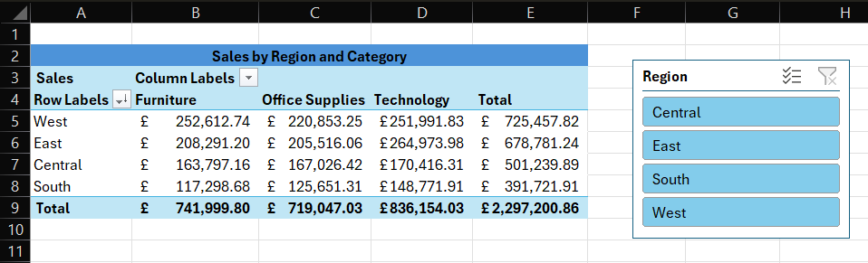

# Data Portfolio

This repository contains my first data analysis projects (Excel, SQL, Python, Power BI).

## Excel Project: Superstore Pivot Analysis
- Used the Superstore dataset to analyze sales by Region and Category.
- Built a Pivot Table showing total sales by region & product category.
- Added a report for Top 5 products.
- Created slicers to filter by Year and Region.

### Screenshot

